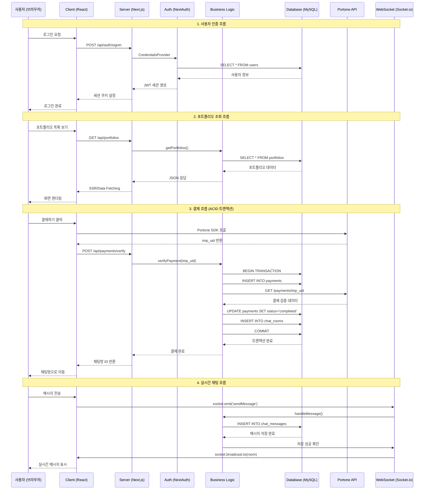

# 백억광고 (100BillionAds) 시스템 아키텍처

## System Architecture Diagram

```mermaid
graph TB
    subgraph "Client Layer (브라우저)"
        A[React 19.2.0 UI]
        B[Socket.io Client 4.8.1]
        C[NextAuth.js Session]
        D[Portone SDK]
    end

    subgraph "Presentation Layer (Next.js 16.0.1)"
        E[App Router<br/>페이지 라우팅]
        F[Server Components<br/>SSR/SSG]
        G[Client Components<br/>인터랙션]
        H[Tailwind CSS<br/>스타일링]
    end

    subgraph "Server Layer (Node.js)"
        I[Custom Server<br/>server.js]
        J[Next.js API Routes<br/>/api/*]
        K[NextAuth.js 4.24.13<br/>인증/세션]
        L[Socket.io Server 4.8.1<br/>실시간 통신]
    end

    subgraph "Business Logic Layer"
        M[Portfolio Service<br/>포트폴리오 관리]
        N[Payment Service<br/>결제 처리]
        O[Chat Service<br/>채팅 관리]
        P[User Service<br/>사용자 관리]
    end

    subgraph "Data Access Layer"
        Q[mysql2 Driver 3.15.3]
        R[DB Connection Pool<br/>연결 풀 관리]
        S[Transaction Manager<br/>트랜잭션 제어]
    end

    subgraph "Database Layer"
        T[(MySQL 8.0<br/>InnoDB Engine)]
    end

    subgraph "External Services"
        U[Portone API<br/>포트원 결제 게이트웨이]
    end

    subgraph "File Storage"
        V[/public/uploads/<br/>Local File System]
    end

    %% Client to Presentation
    A --> E
    A --> F
    A --> G
    B --> I
    C --> K
    D --> U

    %% Presentation to Server
    E --> J
    F --> J
    G --> J
    H -.스타일링.-> G

    %% Server Layer Connections
    I --> L
    J --> K
    J --> M
    J --> N
    J --> O
    J --> P
    L --> O

    %% Business to Data Access
    M --> Q
    N --> Q
    O --> Q
    P --> Q
    Q --> R
    R --> S

    %% Data Access to Database
    S --> T

    %% File Storage
    M --> V
    O --> V
    P --> V

    %% External Services
    N --> U

    %% Real-time Flow
    L -.실시간 메시지.-> B

    style A fill:#61dafb,stroke:#333,stroke-width:2px,color:#000
    style B fill:#010101,stroke:#333,stroke-width:2px,color:#fff
    style I fill:#68a063,stroke:#333,stroke-width:2px,color:#fff
    style L fill:#010101,stroke:#333,stroke-width:2px,color:#fff
    style T fill:#00758f,stroke:#333,stroke-width:2px,color:#fff
    style U fill:#fc6b2d,stroke:#333,stroke-width:2px,color:#fff
    style V fill:#ffa500,stroke:#333,stroke-width:2px,color:#000
```

## Simplified Flow Architecture



## Layer-by-Layer Architecture

### 1️⃣ Client Layer (클라이언트 레이어)

**기술 스택:**
- **React 19.2.0**: 최신 React (Server Components, Transitions, Suspense)
- **Socket.io Client 4.8.1**: 실시간 양방향 통신
- **NextAuth.js Client**: 세션 상태 관리 (`useSession` hook)
- **Portone Browser SDK**: 결제 UI 호출

**주요 역할:**
- 사용자 인터페이스 렌더링
- 사용자 입력 처리 및 검증
- 실시간 WebSocket 연결 관리
- 클라이언트 사이드 라우팅

**파일 위치:**
```
src/app/
├── (auth)/            # 인증 페이지
├── portfolio/         # 포트폴리오 페이지
├── chat/              # 채팅 페이지
├── payment/           # 결제 페이지
└── components/        # 재사용 컴포넌트
```

---

### 2️⃣ Presentation Layer (프레젠테이션 레이어)

**기술 스택:**
- **Next.js 16.0.1 App Router**: 파일 기반 라우팅, Server Actions
- **Server Components**: 기본 SSR, 데이터 페칭 최적화
- **Client Components**: 인터랙션, useState, useEffect
- **Tailwind CSS 4**: 유틸리티 CSS 프레임워크

**주요 역할:**
- 페이지 라우팅 및 레이아웃 관리
- SSR/SSG를 통한 초기 로딩 최적화
- SEO 메타데이터 관리
- 반응형 디자인 구현

**렌더링 전략:**
```javascript
// Server Component (기본값)
async function PortfolioPage() {
  const portfolios = await fetchPortfolios(); // 서버에서 실행
  return <PortfolioList data={portfolios} />;
}

// Client Component
'use client';
function ChatInput() {
  const [message, setMessage] = useState('');
  // 클라이언트 인터랙션
}
```

---

### 3️⃣ Server Layer (서버 레이어)

**기술 스택:**
- **Custom Server (server.js)**: Node.js HTTP 서버 + Next.js 통합
- **Next.js API Routes**: RESTful API 엔드포인트 (`/api/*`)
- **NextAuth.js 4.24.13**: JWT 기반 인증, CredentialsProvider
- **Socket.io Server 4.8.1**: WebSocket 서버

**주요 역할:**
- HTTP 요청 라우팅 및 처리
- API 엔드포인트 제공
- 사용자 인증 및 권한 관리
- 실시간 WebSocket 연결 관리

**Custom Server 구조:**
```javascript
// server.js
const httpServer = createServer(async (req, res) => {
  await handle(req, res, parsedUrl); // Next.js 라우팅
});

const io = new Server(httpServer, {
  cors: { origin: '*', methods: ['GET', 'POST'] }
});

io.on('connection', (socket) => {
  // 실시간 채팅 핸들러
  socket.on('sendMessage', async (data) => {
    await saveMessageToDB(data);
    socket.broadcast.to(roomId).emit('newMessage', data);
  });
});
```

**API Routes 예시:**
```
/api/
├── auth/[...nextauth]/route.js  # NextAuth 인증
├── portfolios/route.js          # 포트폴리오 CRUD
├── payments/
│   ├── route.js                 # 결제 생성
│   └── verify/route.js          # 결제 검증
└── chat/
    ├── rooms/route.js           # 채팅방 목록
    └── messages/route.js        # 메시지 조회
```

---

### 4️⃣ Business Logic Layer (비즈니스 로직 레이어)

**서비스 모듈:**
- **Portfolio Service**: 포트폴리오 등록, 수정, 삭제, 조회
- **Payment Service**: 결제 생성, 검증, 취소, 에스크로 처리
- **Chat Service**: 채팅방 생성, 메시지 전송, 읽음 처리
- **User Service**: 사용자 CRUD, 역할 관리

**핵심 비즈니스 로직:**

**1) 결제 검증 및 채팅방 생성 (ACID 트랜잭션)**
```javascript
async function verifyPaymentAndCreateChatRoom(imp_uid, merchant_uid) {
  const connection = await pool.getConnection();
  
  try {
    await connection.beginTransaction(); // START TRANSACTION
    
    // 1. Portone API 결제 검증
    const paymentData = await axios.get(`https://api.portone.io/payments/${imp_uid}`);
    
    // 2. DB 결제 레코드 업데이트
    await connection.query(`
      UPDATE payments 
      SET status = 'completed', imp_uid = ?, paid_at = NOW()
      WHERE merchant_uid = ?
    `, [imp_uid, merchant_uid]);
    
    // 3. 채팅방 자동 생성
    const [result] = await connection.query(`
      INSERT INTO chat_rooms (payment_id, designer_id, client_id, portfolio_id)
      SELECT p.id, pf.designer_id, p.user_id, pf.id
      FROM payments p
      JOIN portfolios pf ON p.portfolio_id = pf.id
      WHERE p.merchant_uid = ?
    `, [merchant_uid]);
    
    await connection.commit(); // COMMIT
    return { success: true, roomId: result.insertId };
    
  } catch (error) {
    await connection.rollback(); // ROLLBACK
    throw error;
  } finally {
    connection.release();
  }
}
```

**2) 실시간 채팅 메시지 처리**
```javascript
socket.on('sendMessage', async (data) => {
  const { roomId, senderId, content } = data;
  
  // DB 저장 우선
  const [result] = await connection.query(`
    INSERT INTO chat_messages (room_id, sender_id, content)
    VALUES (?, ?, ?)
  `, [roomId, senderId, content]);
  
  // 채팅방 마지막 메시지 업데이트
  await connection.query(`
    UPDATE chat_rooms 
    SET last_message = ?, last_message_at = NOW()
    WHERE id = ?
  `, [content, roomId]);
  
  // Socket.io 브로드캐스트 (DB 저장 후)
  io.to(roomId).emit('newMessage', {
    id: result.insertId,
    roomId,
    senderId,
    content,
    created_at: new Date()
  });
});
```

---

### 5️⃣ Data Access Layer (데이터 접근 레이어)

**기술 스택:**
- **mysql2 Driver 3.15.3**: Promise 기반 MySQL 드라이버
- **Connection Pool**: 최대 10개 동시 연결 관리
- **Transaction Manager**: BEGIN, COMMIT, ROLLBACK 제어

**Connection Pool 설정:**
```javascript
const pool = mysql.createPool({
  host: 'localhost',
  user: 'root',
  password: 'merk',
  database: '10badv',
  waitForConnections: true,
  connectionLimit: 10,        // 최대 연결 수
  queueLimit: 0,              // 무제한 큐
  enableKeepAlive: true,
  keepAliveInitialDelay: 0
});
```

**트랜잭션 패턴:**
```javascript
// 1. 연결 획득
const connection = await pool.getConnection();

try {
  // 2. 트랜잭션 시작
  await connection.beginTransaction();
  
  // 3. 여러 쿼리 실행
  await connection.query('INSERT INTO ...');
  await connection.query('UPDATE ...');
  
  // 4. 커밋
  await connection.commit();
  
} catch (error) {
  // 5. 롤백
  await connection.rollback();
  throw error;
  
} finally {
  // 6. 연결 반환
  connection.release();
}
```

**동시성 제어 (FOR UPDATE Lock):**
```javascript
// 비관적 락(Pessimistic Lock)
await connection.query(`
  SELECT * FROM payments 
  WHERE id = ? 
  FOR UPDATE
`, [paymentId]);

// 이후 UPDATE 쿼리 실행 시 다른 트랜잭션은 대기
```

---

### 6️⃣ Database Layer (데이터베이스 레이어)

**기술 스택:**
- **MySQL 8.0**: 관계형 데이터베이스
- **InnoDB Engine**: ACID 트랜잭션, Row-Level Locking
- **utf8mb4 Charset**: 이모지 포함 전체 UTF-8 지원

**핵심 특징:**
- **ACID 트랜잭션**: Atomicity, Consistency, Isolation, Durability 보장
- **Foreign Key Constraints**: 참조 무결성 자동 관리
- **Indexes**: 검색 성능 최적화 (B-Tree 인덱스)
- **Enum Types**: 데이터 무결성 강화

**테이블 구조:**
```
7개 핵심 테이블:
├── users               # 사용자
├── portfolios          # 포트폴리오
├── portfolio_images    # 포트폴리오 이미지
├── payments            # 결제
├── chat_rooms          # 채팅방
├── chat_messages       # 채팅 메시지
└── chat_participants   # 채팅 참여자
```

---

### 7️⃣ External Services (외부 서비스)

**Portone (포트원) 결제 게이트웨이:**
- **역할**: PG사 중개, 결제 처리, 결제 검증
- **연동 방식**: REST API + Browser SDK
- **지원 결제 수단**: 카드, 계좌이체, 가상계좌, 휴대폰

**결제 흐름:**
```
1. 클라이언트: Portone SDK 호출 → PG사 결제창 오픈
2. 사용자: 결제 정보 입력 → PG사 승인
3. Portone: imp_uid 생성 → 클라이언트 반환
4. 서버: Portone API 호출 → 결제 정보 검증
5. 서버: DB 업데이트 → 결제 완료 처리
```

**API 엔드포인트:**
```
https://api.portone.io/payments/{imp_uid}
```

---

### 8️⃣ File Storage (파일 저장소)

**Local File System:**
- **위치**: `/public/uploads/`
- **접근**: Next.js Static Files (Public Directory)

**디렉토리 구조:**
```
/public/uploads/
├── avatars/           # 사용자 프로필 이미지
│   └── user_123.jpg
├── portfolios/
│   ├── thumbnails/    # 포트폴리오 썸네일
│   └── images/        # 포트폴리오 이미지
└── chat/              # 채팅 이미지/파일
    └── room_45_file.png
```

**파일 업로드 처리:**
```javascript
// API Route: /api/upload
export async function POST(request) {
  const formData = await request.formData();
  const file = formData.get('file');
  
  // 파일 검증
  if (!file || file.size > 5 * 1024 * 1024) {
    return NextResponse.json({ error: '파일 크기 초과 (최대 5MB)' });
  }
  
  // 파일 저장
  const buffer = Buffer.from(await file.arrayBuffer());
  const filename = `${Date.now()}_${file.name}`;
  const filepath = path.join(process.cwd(), 'public', 'uploads', 'chat', filename);
  
  await fs.promises.writeFile(filepath, buffer);
  
  return NextResponse.json({ 
    url: `/uploads/chat/${filename}` 
  });
}
```

---

## Communication Patterns (통신 패턴)

### 1. HTTP Request/Response (RESTful API)
- **용도**: CRUD 작업, 데이터 조회
- **프로토콜**: HTTP/1.1, HTTPS
- **형식**: JSON

### 2. WebSocket (Socket.io)
- **용도**: 실시간 채팅, 알림
- **프로토콜**: WebSocket (Fallback: Long Polling)
- **특징**: 양방향 실시간 통신

### 3. Server-Side Rendering (SSR)
- **용도**: 초기 페이지 로딩, SEO
- **장점**: 빠른 FCP (First Contentful Paint)

### 4. Client-Side Rendering (CSR)
- **용도**: 동적 인터랙션, SPA
- **장점**: 부드러운 UX, 빠른 페이지 전환

---

## Performance Optimization (성능 최적화)

### 1. Database Optimization
- **Connection Pool**: 최대 10개 동시 연결 재사용
- **Indexes**: 모든 FK 및 검색 필드에 인덱스 설정
- **Query Optimization**: JOIN 최소화, SELECT 컬럼 명시

### 2. Caching Strategy
- **React Server Components**: 자동 캐싱
- **Next.js Data Cache**: `fetch()` 요청 캐싱
- **Static Assets**: CDN 활용 가능 (Public 폴더)

### 3. Real-time Optimization
- **Room-based Broadcasting**: 채팅방별 메시지 전송
- **DB First, Socket Second**: 메시지 손실 방지
- **Unread Count Cache**: chat_participants 테이블 활용

### 4. Code Splitting
- **Dynamic Import**: `next/dynamic`
- **Route-based Splitting**: App Router 자동 분할

---

## Security Measures (보안)

### 1. Authentication (인증)
- **NextAuth.js**: JWT 기반 세션
- **bcrypt**: 비밀번호 해싱 (개발: 평문, 프로덕션: bcrypt)
- **Session Cookie**: httpOnly, secure, sameSite

### 2. Authorization (권한)
- **Role-based Access Control**: admin, user, designer
- **API Route Protection**: `getServerSession()` 검증

### 3. Input Validation
- **SQL Injection 방지**: Prepared Statements (mysql2 `?` placeholder)
- **XSS 방지**: React 자동 이스케이핑
- **CSRF 방지**: NextAuth.js CSRF 토큰

### 4. Payment Security
- **Server-side Verification**: Portone API 서버 검증 필수
- **Amount Validation**: 클라이언트 금액과 서버 금액 비교
- **Idempotency**: merchant_uid UNIQUE 제약조건

---

## Scalability Considerations (확장성)

### 현재 아키텍처 (Monolithic)
- **Single Server**: Custom Server (server.js)
- **Single Database**: MySQL 8.0
- **Local File Storage**: /public/uploads/

### 향후 확장 가능성

**1. Microservices Architecture**
```
├── API Gateway (Kong, Nginx)
├── Auth Service (NextAuth.js)
├── Portfolio Service
├── Payment Service
├── Chat Service (Socket.io Cluster)
└── Notification Service
```

**2. Database Scaling**
- **Read Replicas**: 읽기 전용 복제본
- **Sharding**: 사용자 ID 기반 샤딩
- **Redis Cache**: 세션, 채팅방 목록 캐싱

**3. File Storage Migration**
- **AWS S3**: 클라우드 스토리지
- **CloudFront CDN**: 전 세계 배포

**4. Real-time Scaling**
- **Socket.io Redis Adapter**: 다중 서버 WebSocket
- **Message Queue (RabbitMQ)**: 비동기 메시지 처리

---

## Deployment Architecture (배포 아키텍처)

### Development (개발 환경)
```
localhost:3000 (Next.js Dev Server)
├── Hot Module Replacement (HMR)
├── Source Maps
└── MySQL localhost:3306
```

### Production (프로덕션 환경)
```
Node.js 프로세스
├── server.js (Custom Server)
├── Socket.io Server
└── Next.js Production Build

MySQL 8.0 (별도 서버)
├── InnoDB Engine
├── Connection Pool
└── Replication (향후)

File Storage
└── /public/uploads/ (향후 S3 마이그레이션)
```

**배포 명령어:**
```bash
npm run build      # Next.js 빌드
NODE_ENV=production node server.js  # 프로덕션 서버 실행
```

---

## Monitoring & Logging (모니터링 & 로깅)

### Current Logging
```javascript
console.log('✅ 소켓 연결:', socket.id);
console.error('❌ 데이터베이스 연결 실패:', error);
```

### Recommended Tools
- **Application Monitoring**: New Relic, DataDog
- **Error Tracking**: Sentry
- **Database Monitoring**: MySQL Workbench, Percona Monitoring
- **Log Aggregation**: ELK Stack (Elasticsearch, Logstash, Kibana)

---

## Technology Stack Summary

| Layer | Technology | Version | Purpose |
|-------|-----------|---------|---------|
| **Frontend** | React | 19.2.0 | UI 컴포넌트 |
| | Next.js | 16.0.1 | 프레임워크 |
| | Tailwind CSS | 4 | 스타일링 |
| | Socket.io Client | 4.8.1 | 실시간 통신 |
| **Backend** | Node.js | - | 런타임 |
| | Next.js API Routes | 16.0.1 | REST API |
| | NextAuth.js | 4.24.13 | 인증 |
| | Socket.io Server | 4.8.1 | WebSocket |
| **Database** | MySQL | 8.0 | RDBMS |
| | mysql2 | 3.15.3 | 드라이버 |
| **Payment** | Portone SDK | 0.1.1 | 결제 게이트웨이 |
| **Security** | bcrypt | 6.0.0 | 비밀번호 해싱 |

---

## Diagram Rendering

위의 Mermaid 다이어그램은 다음 플랫폼에서 렌더링 가능합니다:
- ✅ GitHub README.md (자동 렌더링)
- ✅ [Mermaid Live Editor](https://mermaid.live/)
- ✅ VS Code Markdown Preview (Mermaid 플러그인)
- ✅ Notion, Confluence (Mermaid 지원 플랫폼)

---

## References

- **Next.js Documentation**: https://nextjs.org/docs
- **Socket.io Documentation**: https://socket.io/docs/
- **NextAuth.js Documentation**: https://next-auth.js.org/
- **Portone API Documentation**: https://developers.portone.io/
- **MySQL 8.0 Reference**: https://dev.mysql.com/doc/refman/8.0/en/
