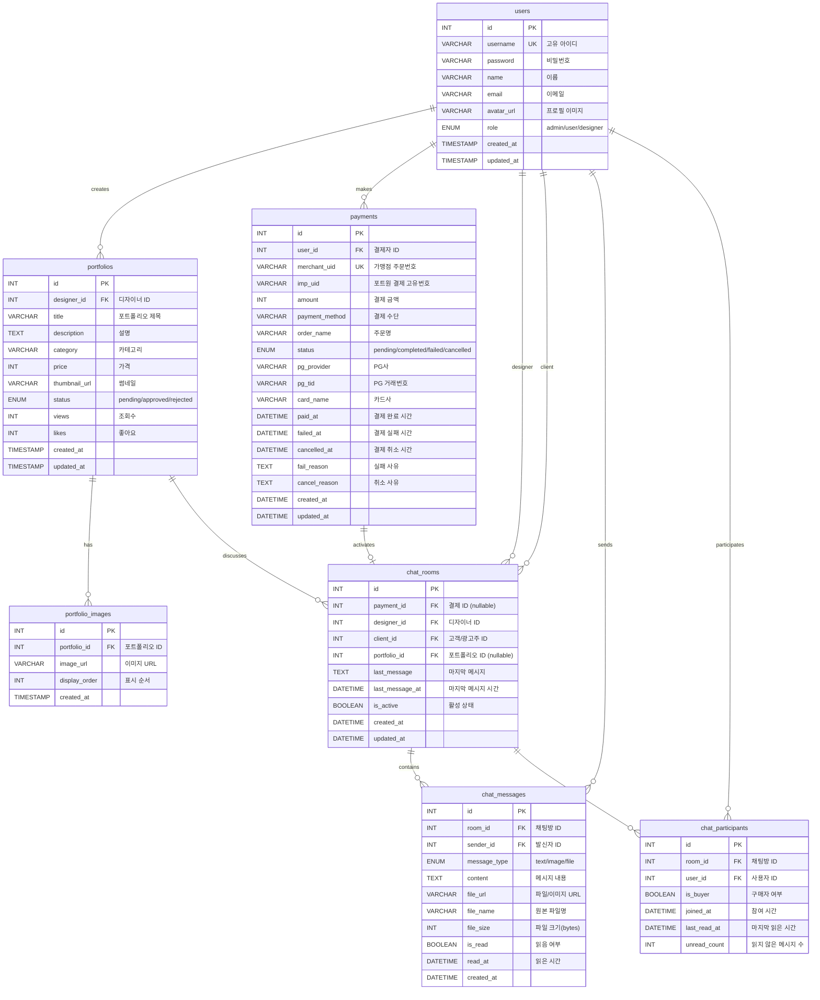

# 백억광고 (100BillionAds) ERD

## Entity Relationship Diagram



## 테이블 설명

### 1. users (사용자)
- **역할**: 플랫폼의 모든 사용자 정보 관리
- **주요 필드**:
  - `role`: admin(관리자), user(일반 사용자/광고주), designer(디자이너)
  - `avatar_url`: 프로필 이미지 경로
- **관계**: 포트폴리오, 결제, 채팅의 중심 엔티티

### 2. portfolios (포트폴리오)
- **역할**: 디자이너가 등록한 디자인 작품 관리
- **주요 필드**:
  - `status`: pending(대기), approved(승인), rejected(거부)
  - `price`: 포트폴리오 가격
  - `views`, `likes`: 조회수, 좋아요 수
- **관계**: 디자이너(users)가 생성, 여러 이미지 포함

### 3. portfolio_images (포트폴리오 이미지)
- **역할**: 포트폴리오의 이미지 파일들 관리
- **주요 필드**:
  - `display_order`: 이미지 표시 순서
  - `image_url`: 이미지 저장 경로
- **관계**: 하나의 포트폴리오에 여러 이미지 첨부 가능

### 4. payments (결제)
- **역할**: 포트원(Portone) 결제 내역 관리
- **주요 필드**:
  - `merchant_uid`: 가맹점 주문번호 (UNIQUE)
  - `imp_uid`: 포트원 결제 고유번호
  - `status`: pending(대기), completed(완료), failed(실패), cancelled(취소)
  - `pg_provider`: PG사 정보
- **관계**: 결제 완료 시 채팅방 활성화

### 5. chat_rooms (채팅방)
- **역할**: 디자이너-클라이언트 간 1:1 채팅방 관리
- **주요 필드**:
  - `payment_id`: 결제 후 생성된 채팅방 (nullable)
  - `is_active`: 활성 상태
  - `last_message_at`: 최근 메시지 시간
- **관계**: 
  - 결제 완료 시 자동 생성
  - 디자이너와 클라이언트 간 1:1 매칭

### 6. chat_messages (채팅 메시지)
- **역할**: 실시간 채팅 메시지 저장
- **주요 필드**:
  - `message_type`: text(텍스트), image(이미지), file(파일)
  - `is_read`: 읽음 여부
  - `file_url`, `file_name`, `file_size`: 파일 첨부 정보
- **관계**: Socket.io로 실시간 전송, DB에 영구 저장

### 7. chat_participants (채팅 참여자)
- **역할**: 채팅방 참여자 정보 및 읽음 상태 관리
- **주요 필드**:
  - `is_buyer`: 결제 완료한 구매자 여부
  - `unread_count`: 읽지 않은 메시지 수
  - `last_read_at`: 마지막 읽은 시간
- **관계**: 채팅방과 사용자의 다대다(M:N) 관계 중재

## 핵심 비즈니스 로직

### 1. 결제 → 채팅방 생성 흐름
```
1. 사용자가 포트폴리오 결제 (payments 테이블 INSERT)
2. 결제 완료 시 (status = 'completed')
3. chat_rooms 자동 생성 (payment_id, designer_id, client_id 연결)
4. Socket.io로 실시간 채팅 활성화
```

### 2. 채팅 메시지 저장 패턴
```
1. 사용자 메시지 전송 (Socket.io)
2. DB에 먼저 저장 (chat_messages INSERT)
3. 저장 성공 후 상대방에게 Socket 브로드캐스트
4. 메시지 손실 방지: DB 저장 우선, Socket은 알림 용도
```

### 3. 읽지 않은 메시지 카운트
```
1. chat_participants의 unread_count 활용
2. 메시지 수신 시 unread_count + 1
3. 사용자가 채팅방 입장 시 unread_count = 0, last_read_at 업데이트
4. 실시간 알림: Socket.io로 unread_count 변경 브로드캐스트
```

## 기술 스택

### Database
- **MySQL 8.0**: 관계형 데이터베이스
- **InnoDB Engine**: ACID 트랜잭션 보장
- **utf8mb4 Charset**: 이모지 포함 전체 UTF-8 지원

### Indexes
- **Primary Keys**: 모든 테이블의 `id` 컬럼
- **Foreign Keys**: ON DELETE CASCADE/SET NULL로 참조 무결성 보장
- **Performance Indexes**: 
  - `users.username` (UNIQUE)
  - `payments.merchant_uid` (UNIQUE)
  - `chat_rooms.payment_id` (UNIQUE)
  - 검색/필터링 성능 최적화 인덱스 다수

### Constraints
- **UNIQUE**: username, merchant_uid, room-user 조합
- **ENUM**: status, role, message_type 등 제한된 값 강제
- **CASCADE**: 부모 삭제 시 자식 레코드 자동 삭제
- **SET NULL**: 부모 삭제 시 FK를 NULL로 설정

## 데이터 무결성

### 1. 외래 키 제약조건
- 모든 FK는 `FOREIGN KEY ... REFERENCES` 선언
- 부모 테이블 삭제 시 자동 처리: CASCADE 또는 SET NULL

### 2. Enum 타입 활용
- `users.role`: 역할 제한 (admin/user/designer)
- `payments.status`: 결제 상태 명확화
- `chat_messages.message_type`: 메시지 타입 제한

### 3. 트랜잭션 보장
- 결제 + 채팅방 생성: BEGIN → INSERT payments → INSERT chat_rooms → COMMIT
- 에러 발생 시 ROLLBACK으로 데이터 일관성 유지

### 4. 동시성 제어
- `FOR UPDATE` 락으로 동시 결제 충돌 방지
- InnoDB Row-Level Locking으로 동시 접근 제어

## ERD 다이어그램 보는 법

- **||--o{**: 일대다(1:N) 관계
- **||--o|**: 일대일(1:1) 관계 (nullable)
- **PK**: Primary Key (기본 키)
- **FK**: Foreign Key (외래 키)
- **UK**: Unique Key (고유 키)
- **ENUM**: 제한된 값만 허용
- **BOOLEAN**: TRUE/FALSE

## Mermaid ERD 렌더링

위의 Mermaid 다이어그램은 다음 플랫폼에서 렌더링 가능합니다:
- GitHub README.md (자동 렌더링)
- [Mermaid Live Editor](https://mermaid.live/)
- VS Code Markdown Preview (Mermaid 플러그인)
- Notion, Confluence 등 (Mermaid 지원 플랫폼)

## 파일 위치

- 사용자 아바타: `/public/uploads/avatars/`
- 포트폴리오 썸네일: `/public/uploads/portfolios/thumbnails/`
- 포트폴리오 이미지: `/public/uploads/portfolios/images/`
- 채팅 이미지: `/public/uploads/chat/`
