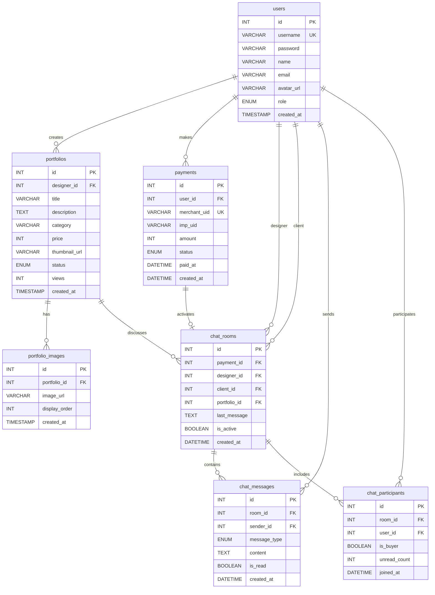

# 🎨 Gemini PPT 자동 생성 프롬프트

> Google Gemini에게 전달하여 자동으로 PowerPoint/PDF 파일을 생성하는 프롬프트입니다.

---

## 📋 전체 요청사항

다음 내용으로 **16:9 비율의 프로페셔널한 프로젝트 발표 PowerPoint 파일**을 생성해주세요:

### 기본 설정
- **파일 형식**: PPTX (PowerPoint) 또는 PDF
- **슬라이드 비율**: 16:9 (1920x1080px)
- **총 슬라이드 수**: 15장
- **폰트**: 
  - 제목: Pretendard Bold, 44pt
  - 본문: Pretendard Regular, 20pt
  - 코드: Fira Code, 16pt
- **언어**: 한국어

### 디자인 스타일
- **전체 톤앤매너**: 모던 테크 스타일
- **색상 팔레트**:
  - Primary: 보라색 (#667eea)
  - Secondary: 파란색 (#4299e1)
  - Background: 흰색 (#ffffff), 밝은 회색 (#f7fafc)
  - Text: 진한 회색 (#1a202c)
  - Accent: 초록 (#38a169), 빨강 (#e53e3e), 주황 (#ed8936)
- **레이아웃**: 여백 충분 (상하좌우 80px), 깔끔한 정렬
- **애니메이션**: 페이드 인 효과만 사용 (과도한 애니메이션 지양)

---

## 📊 슬라이드별 상세 내용

### 슬라이드 1: 표지 (Title Slide)
**배경**: 보라색 그라데이션 (#667eea → #764ba2)  
**텍스트 색상**: 흰색 (#ffffff)  
**레이아웃**: 중앙 정렬

```
[상단 중앙에 로고 또는 🎨 이모지]

백억광고 (100BillionAds)
══════════════════════════════

디자이너와 광고주를 연결하는
안전한 디자인 거래 플랫폼

─────────────────────────────

Next.js • React • Socket.io • MySQL

개발자: 송동준
버전: v1.0.0
2025년 12월
```

**디자인 요구사항**:
- 제목 "백억광고"는 72pt, 굵게
- 부제목은 28pt, 연한 흰색
- 기술 스택은 작게 20pt, 아이콘과 함께
- 하단에 개발자 정보 16pt

---

### 슬라이드 2: 목차 (Table of Contents)
**배경**: 흰색 (#ffffff)  
**텍스트**: 진한 회색 (#1a202c)  
**레이아웃**: 2열 그리드

```
┌────────────────────────────────────────────┐
│              📋 발표 목차                  │
├──────────────────┬─────────────────────────┤
│                  │                         │
│  01 프로젝트 개요  │  08 시스템 아키텍처     │
│  02 문제 정의     │  09 데이터베이스 설계   │
│  03 핵심 솔루션   │  10 거래 프로세스       │
│  04 에스크로 결제  │  11 상태 전환 로직      │
│  05 실시간 채팅    │  12 에스크로 알고리즘   │
│  06 4단계 프로세스 │  13 채팅 시스템 구현    │
│  07 기술 스택     │  14 프로젝트 성과       │
│                  │  15 Q&A                 │
└──────────────────┴─────────────────────────┘
```

**디자인 요구사항**:
- 목차는 2열로 균등 배치
- 각 항목 앞에 숫자와 이모지
- 현재 슬라이드는 보라색 하이라이트
- 항목 간 간격 넉넉하게 (20px)

---

### 슬라이드 3: 프로젝트 개요 (Project Overview)
**배경**: 흰색 (#ffffff)  
**텍스트**: 진한 회색 (#1a202c)  
**레이아웃**: 3단 카드 레이아웃

```
┌────────────────────────────────────────────┐
│   🎨 디자이너 ↔ 🔄 플랫폼 ↔ 👔 광고주    │
├────────────────────────────────────────────┤
│                                            │
│         "안전한 거래, 투명한 프로세스"      │
│                                            │
├──────────────┬──────────────┬──────────────┤
│              │              │              │
│  👨‍🎨 디자이너  │  🔄 플랫폼    │  👔 광고주   │
│              │              │              │
│  ✓ 안정적 수주 │  ✓ 에스크로   │  ✓ 품질 보장 │
│  ✓ 자동 정산   │  ✓ 채팅 관리  │  ✓ 안전 결제 │
│  ✓ 평판 구축   │  ✓ 승인 시스템│  ✓ 분쟁 방지 │
│              │              │              │
└──────────────┴──────────────┴──────────────┘

주요 특징
🔒 에스크로 결제    💬 실시간 채팅
📊 4단계 프로세스   ⭐ 리뷰 시스템
```

**디자인 요구사항**:
- 상단에 큰 제목과 캐치프레이즈
- 3개의 카드는 그림자 효과 (shadow)
- 각 카드는 아이콘 + 3개 체크리스트
- 하단 주요 특징은 4개 배지 형태
- 카드 배경: 연한 보라/파랑/초록 (#faf5ff, #ebf8ff, #f0fff4)

---

### 슬라이드 4: 문제 정의 (Problem Statement)
**배경**: 연한 빨강 (#fff5f5)  
**텍스트**: 진한 회색 (#1a202c)  
**레이아웃**: 2x2 그리드

```
┌────────────────────────────────────────────┐
│      기존 디자인 거래 플랫폼의 4가지 문제   │
├──────────────────┬─────────────────────────┤
│                  │                         │
│  ❌ 신뢰 문제      │  💬 소통 문제            │
│                  │                         │
│  • 선입금 리스크    │  • 외부 메신저 의존      │
│  • 대금 지급 거부   │  • 대화 이력 미보존      │
│  • 사기 피해       │  • 증거 자료 부족        │
│  • 중개자 부재     │  • 요구사항 불명확       │
│                  │                         │
├──────────────────┼─────────────────────────┤
│                  │                         │
│  💰 정산 문제      │  📊 품질 관리 문제       │
│                  │                         │
│  • 정산 지연 3~8일 │  • 포트폴리오 검증 부재  │
│  • 수수료 불명확    │  • 허위 작품 등록        │
│  • 수동 처리       │  • 품질 기준 없음        │
│  • 중간 착복 위험   │  • 평판 시스템 부재      │
│                  │                         │
└──────────────────┴─────────────────────────┘
```

**디자인 요구사항**:
- 2x2 그리드, 각 사분면에 큰 이모지
- 각 문제는 4개 불릿 포인트
- 배경색: 연한 빨강 (#fff5f5)
- 텍스트 강조: 진한 빨강 (#c53030)

---

### 슬라이드 5: 핵심 솔루션 (Core Solutions)
**배경**: 연한 초록 (#f0fff4)  
**텍스트**: 진한 회색 (#1a202c)  
**레이아웃**: 4개 솔루션 카드

```
┌────────────────────────────────────────────┐
│           우리의 4가지 핵심 솔루션          │
├────────────────────────────────────────────┤
│                                            │
│  🔒 솔루션 1: 에스크로 결제 시스템          │
│  ───────────────────────────────────────  │
│  • 광고주 → [플랫폼 예치] → 디자이너       │
│  • 작업 완료 후 자동 정산                  │
│  • 분쟁 시 중재 및 환불                    │
│                                            │
│  💬 솔루션 2: 플랫폼 내장 실시간 채팅       │
│  ───────────────────────────────────────  │
│  • Socket.io 기반 실시간 양방향 통신       │
│  • DB 영구 저장 (증거 자료 확보)           │
│  • 파일 전송, 읽음 확인 기능               │
│                                            │
│  📊 솔루션 3: 4단계 거래 프로세스           │
│  ───────────────────────────────────────  │
│  • pending → in_progress → awaiting        │
│    → completed                            │
│  • 명확한 단계별 권한 및 역할 분리         │
│  • 수정 요청 기능 (awaiting ↔ in_progress) │
│                                            │
│  ⭐ 솔루션 4: 승인 및 리뷰 시스템           │
│  ───────────────────────────────────────  │
│  • 관리자 포트폴리오 승인 (품질 관리)      │
│  • 거래 완료 후 리뷰 작성 (별점 5점)       │
│  • 평판 기반 신뢰도 구축                   │
│                                            │
└────────────────────────────────────────────┘
```

**디자인 요구사항**:
- 4개 솔루션을 카드 형태로 세로 배치
- 각 카드는 아이콘 + 제목 + 3개 불릿
- 카드 배경: 흰색, 그림자 효과
- 아이콘은 크게 (48px)

---

### 슬라이드 6: 에스크로 결제 상세 (Escrow Payment Details)
**배경**: 연한 노랑 (#fffbeb)  
**텍스트**: 진한 회색 (#1a202c)  
**레이아웃**: 플로우차트 + 설명

```
┌────────────────────────────────────────────┐
│          🔒 에스크로 결제 프로세스          │
├────────────────────────────────────────────┤
│                                            │
│  ┌─────────┐      ┌─────────┐             │
│  │ 광고주   │ ───→ │ 플랫폼   │             │
│  │ 결제     │      │ (예치)  │             │
│  └─────────┘      └─────────┘             │
│       │                 │                  │
│       │ 💰 포인트 차감    │ 🔒 Lock         │
│       ↓                 ↓                  │
│  ┌─────────────────────────────┐          │
│  │      작업 진행 (안전 보장)     │          │
│  └─────────────────────────────┘          │
│       │                 │                  │
│       │ ✅ 작업 완료      │                  │
│       ↓                 ↓                  │
│  ┌─────────┐      ┌─────────┐             │
│  │ 광고주   │      │ 디자이너 │             │
│  │ 승인     │ ───→ │ 정산     │             │
│  └─────────┘      └─────────┘             │
│                         │                  │
│                    🔓 Unlock               │
│                    💸 자동 지급             │
│                                            │
├────────────────────────────────────────────┤
│  핵심 장점                                  │
│  ✓ 선입금 리스크 제거                       │
│  ✓ ACID 트랜잭션으로 데이터 무결성 보장     │
│  ✓ FOR UPDATE 락으로 동시성 제어            │
│  ✓ 작업 미완료 시 자동 환불                 │
│  ✓ 평균 정산 시간: 즉시 (기존 3~8일)       │
└────────────────────────────────────────────┘
```

**디자인 요구사항**:
- 상단: 플로우차트 (화살표로 연결)
- 각 단계는 박스 + 아이콘
- 하단: 핵심 장점 5개 불릿 포인트
- 배경: 연한 노랑 (#fffbeb)

---

### 슬라이드 7: 실시간 채팅 시스템 (Real-time Chat System)
**배경**: 연한 파랑 (#e6fffa)  
**텍스트**: 진한 회색 (#1a202c)  
**레이아웃**: 채팅 UI 목업 + 설명

```
┌────────────────────────────────────────────┐
│         💬 실시간 채팅 시스템 (Socket.io)   │
├────────────────────────────────────────────┤
│                                            │
│  ┌───────────────────────────────┐        │
│  │  채팅방 #12345                 │        │
│  ├───────────────────────────────┤        │
│  │                               │        │
│  │  👔 광고주: 로고 디자인 부탁해요 │        │
│  │       (10:23 AM)              │        │
│  │                               │        │
│  │  🎨 디자이너: 네, 알겠습니다!   │        │
│  │       (10:25 AM)              │        │
│  │                               │        │
│  │  🎨 디자이너: 📎 logo_v1.png   │        │
│  │       (10:47 AM)              │        │
│  │                               │        │
│  │  👔 광고주: 파란색으로 수정 가능? │        │
│  │       (11:03 AM) ✓✓           │        │
│  │                               │        │
│  └───────────────────────────────┘        │
│                                            │
├────────────────────────────────────────────┤
│  기술적 특징                                │
│  ⚡ WebSocket 프로토콜 (지연시간 <30ms)     │
│  💾 DB 저장 우선 → Socket 전송 (메시지 보존)│
│  📁 파일 전송 지원 (이미지, PDF)            │
│  ✓✓ 읽음 확인 기능                          │
│  🔔 실시간 알림 (unread_count)              │
│  🔒 채팅방별 권한 관리 (디자이너/광고주만)   │
└────────────────────────────────────────────┘
```

**디자인 요구사항**:
- 상단: 실제 채팅 앱처럼 생긴 목업
- 말풍선 스타일 (광고주: 파랑, 디자이너: 회색)
- 하단: 6개 기술 특징 불릿 포인트
- 배경: 연한 파랑 (#e6fffa)

---

### 슬라이드 8: 4단계 거래 프로세스 (4-Step Transaction Process)
**배경**: 흰색 (#ffffff)  
**텍스트**: 진한 회색 (#1a202c)  
**레이아웃**: 가로 타임라인 + 상세 설명

```
┌────────────────────────────────────────────┐
│          📊 4단계 거래 프로세스             │
├────────────────────────────────────────────┤
│                                            │
│  1️⃣────────→2️⃣────────→3️⃣────────→4️⃣      │
│  pending   in_progress  awaiting  completed│
│  💰 결제대기  🔨 작업진행   ✅ 완료대기  🎉 완료 │
│                                            │
│              ↻ 수정 요청 (되돌리기)         │
│                                            │
├────────────────────────────────────────────┤
│  단계별 상세 설명                           │
│                                            │
│  1️⃣ pending (결제 대기)                    │
│     • 광고주가 포트폴리오 선택 및 결제      │
│     • 포인트 차감 (에스크로 Lock)           │
│     • 채팅방 자동 생성                      │
│     • 다음: 디자이너가 작업 시작 버튼       │
│                                            │
│  2️⃣ in_progress (작업 진행중)              │
│     • 디자이너가 작업 수행                  │
│     • 채팅으로 실시간 소통                  │
│     • 파일 업로드 및 전송                   │
│     • 다음: 디자이너가 완료 제출            │
│                                            │
│  3️⃣ awaiting_completion (완료 대기)        │
│     • 광고주가 최종 검토                    │
│     • 승인 or 수정 요청 선택                │
│     • 수정 시 ↻ in_progress로 되돌리기     │
│     • 다음: 광고주 승인 버튼                │
│                                            │
│  4️⃣ completed (거래 완료)                  │
│     • 디자이너에게 포인트 자동 정산         │
│     • 리뷰 작성 가능                        │
│     • 채팅방은 읽기 전용으로 유지           │
│     • 거래 종료 (삭제 불가)                 │
│                                            │
└────────────────────────────────────────────┘
```

**디자인 요구사항**:
- 상단: 4단계 타임라인 (원형 노드 + 화살표)
- 각 단계는 색상 구분 (노랑→파랑→주황→초록)
- 하단: 4개 단계 설명 (각 4줄)
- 수정 요청 화살표는 점선으로

---

### 슬라이드 9: 기술 스택 (Technology Stack)
**배경**: 흰색 (#ffffff)  
**텍스트**: 진한 회색 (#1a202c)  
**레이아웃**: 3단 레이어 (Frontend / Backend / Database)

```
┌────────────────────────────────────────────┐
│            💻 Technology Stack              │
├────────────────────────────────────────────┤
│                                            │
│  🎨 Frontend Layer                         │
│  ┌──────────────────────────────────────┐ │
│  │  Next.js 16.0.1    React 19.2.0      │ │
│  │  Tailwind CSS 4    Socket.io Client  │ │
│  │  NextAuth Client   Portone SDK       │ │
│  └──────────────────────────────────────┘ │
│                                            │
│  ⚙️ Backend Layer                          │
│  ┌──────────────────────────────────────┐ │
│  │  Node.js           Next.js API       │ │
│  │  Socket.io Server  NextAuth.js       │ │
│  │  Custom Server     mysql2 Driver     │ │
│  └──────────────────────────────────────┘ │
│                                            │
│  🗄️ Database & Storage                    │
│  ┌──────────────────────────────────────┐ │
│  │  MySQL 8.0         InnoDB Engine     │ │
│  │  Local Storage     /public/uploads   │ │
│  └──────────────────────────────────────┘ │
│                                            │
│  🔗 External Services                      │
│  ┌──────────────────────────────────────┐ │
│  │  Portone API (결제 게이트웨이)        │ │
│  └──────────────────────────────────────┘ │
│                                            │
├────────────────────────────────────────────┤
│  핵심 기술 선정 이유                        │
│  ✓ Next.js: SSR/SSG로 초기 로딩 최적화     │
│  ✓ Socket.io: 실시간 양방향 통신            │
│  ✓ MySQL: ACID 트랜잭션, 관계형 데이터     │
│  ✓ NextAuth: 간편한 인증, 세션 관리        │
└────────────────────────────────────────────┘
```

**디자인 요구사항**:
- 4개 레이어를 카드 형태로 배치
- 각 카드에 로고 아이콘 포함 (Next.js, React, MySQL 등)
- 버전 번호는 작게 표기
- 하단: 기술 선정 이유 4개 불릿

---

### 슬라이드 10: 시스템 아키텍처 (System Architecture)
**배경**: 흰색 (#ffffff)  
**텍스트**: 진한 회색 (#1a202c)  
**레이아웃**: 5개 영역 다이어그램

**다이어그램 요구사항:**

다음과 같은 **5개 영역(Zone)**으로 구성된 시스템 아키텍처 다이어그램을 그려주세요:

**1. 클라이언트 영역 (Client Zone)** - 왼쪽 첫 번째
- 점선 테두리 박스
- 제목: "클라이언트 영역"
- 내용:
  * 노트북 아이콘 3개 (Client 1, Client 2, Client N)
  * 각 클라이언트는 화살표로 다음 영역과 연결

**2. 로드밸런서 영역 (Load Balancer Zone)** - 왼쪽 두 번째
- 점선 테두리 박스
- 제목: "로드밸런서 영역"
- 내용:
  * 주황색 로드밸런서 아이콘 2개 (ALB 1, ALB N)
  * 트리 구조 아이콘으로 표현
  * 클라이언트들의 화살표를 받고, 다음 영역으로 분산

**3. 웹소켓 서버 영역 (WebSocket Server Zone)** - 중앙
- 점선 테두리 박스
- 제목: "웹소켓 서버 영역"
- 내용:
  * 주황색 서버 박스 3개
    - "Websocket Server 1" (상단)
    - "Websocket Server 2" (중앙)
    - "Websocket Server N" (하단)
  * 각 서버는 Next.js 16.0.1 + Socket.io 4.8.1 실행
  * 로드밸런서로부터 화살표 받음
  * 양방향 화살표로 다음 영역과 연결

**4. 메시지 브로커 영역 (Message Broker Zone)** - 오른쪽 두 번째
- 점선 테두리 박스
- 제목: "메시지 브로커 영역"
- 내용:
  * 큰 원형 클러스터 2개
    - "ElastiCache for Redis Cluster 1" (상단)
    - "ElastiCache for Redis Cluster N" (하단)
  * 각 클러스터 안에 파란색 칩 아이콘 3개 (노드 표현)
  * 웹소켓 서버들과 양방향 화살표로 연결
  * 데이터베이스 영역으로 화살표 연결

**5. 스냅샷 저장소 영역 (Snapshot Storage Zone)** - 오른쪽 끝
- 점선 테두리 박스
- 제목: "스냅샷 저장소 영역"
- 내용:
  * 빨간색 데이터베이스 아이콘 1개
  * 라벨: "MySQL 8.0 Database"
  * 메시지 브로커로부터 화살표 받음

**연결 관계 (화살표):**
- Client → ALB: 검은 실선 화살표 (HTTP/WebSocket 요청)
- ALB → WebSocket Server: 검은 실선 화살표 (로드밸런싱)
- WebSocket Server ↔ Redis Cluster: 양방향 검은 실선 화살표 (실시간 메시지 pub/sub)
- Redis Cluster → MySQL: 검은 실선 화살표 (메시지 영구 저장)

**색상 가이드:**
- 클라이언트 아이콘: 회색 또는 검정
- 로드밸런서: 주황색 (#ff8c42)
- 웹소켓 서버: 주황색 (#ff8c42)
- Redis 클러스터 테두리: 파란색 (#4a90e2)
- Redis 노드: 파란색 칩 아이콘
- MySQL 데이터베이스: 빨간색 (#e74c3c)
- 점선 테두리: 연한 회색 (#d3d3d3)

**레이아웃:**
- 5개 영역을 가로로 균등 배치
- 각 영역은 점선 테두리로 구분
- 각 영역 상단에 제목 표시
- 화살표는 데이터 흐름 방향 명확히 표시
- 아이콘은 실제 AWS 또는 클라우드 아키텍처 스타일로

**기술 라벨 추가:**
- WebSocket Server 박스 내부: "Next.js 16.0.1 + Socket.io 4.8.1"
- Redis Cluster 하단: "Pub/Sub + Session Store"
- MySQL 하단: "InnoDB Engine, ACID Transaction"

**참고 이미지 스타일:**
첨부된 이미지와 같은 스타일로 작성해주세요. 각 영역이 명확히 구분되고, 아이콘이 직관적이며, 화살표로 데이터 흐름이 명확히 보이도록 작성해주세요.

---

### 슬라이드 11: 데이터베이스 설계 (Database Design - ERD)
**배경**: 연한 보라 (#faf5ff)  
**텍스트**: 진한 회색 (#1a202c)  
**레이아웃**: Mermaid ERD 다이어그램

**Mermaid ERD 다이어그램 코드:**



**핵심 테이블 (총 7개):**
- ✓ users (사용자)
- ✓ portfolios (포트폴리오)
- ✓ portfolio_images (이미지)
- ✓ payments (결제/에스크로)
- ✓ chat_rooms (채팅방)
- ✓ chat_messages (메시지)
- ✓ chat_participants (참여자)

**주요 관계:**
- users → portfolios (1:N, designer_id)
- users → payments (1:N, user_id)
- payments → chat_rooms (1:1, payment_id)
- chat_rooms → chat_messages (1:N, room_id)

**디자인 요구사항**:
- Mermaid ERD 다이어그램을 렌더링하여 표시
- 모든 FK 관계를 화살표로 명확히 표시
- 각 테이블의 주요 컬럼 표시
- PK, FK, UK 명시

---

### 슬라이드 12: 상태 전환 로직 (State Transition Validation)
**배경**: 흰색 (#ffffff)  
**텍스트**: 진한 회색 (#1a202c)  
**레이아웃**: 좌우 2단 (코드 40% | 설명 60%)

```
┌────────────────────────────────────────────┐
│       🔄 거래 상태 전환 검증 로직           │
├──────────────────┬─────────────────────────┤
│  📝 핵심 코드     │  💡 기술적 특징          │
├──────────────────┼─────────────────────────┤
│                  │                         │
│ const valid      │ ✅ 무효한 상태 전환 차단 │
│ Transitions = {  │   • 완료→진행중 불가    │
│                  │   • 대기→완료 불가      │
│  'pending': [    │                         │
│   'in_progress'  │ 🔒 역할별 권한 검증     │
│  ],              │   • pending→in: 디자이너│
│                  │   • awaiting→done: 광고주│
│  'in_progress':  │                         │
│   ['awaiting'],  │ 🛡️ 데이터 무결성 보장   │
│                  │   • 코드 레벨 강제      │
│  'awaiting': [   │   • DB Constraint       │
│   'completed',   │   • 잘못된 흐름 방지    │
│   'in_progress'  │                         │
│  ],              │ ⚡ 비즈니스 로직 명확화  │
│                  │   • 허용된 전환만 가능  │
│  'completed': [] │   • 예외 처리 간소화    │
│ };               │   • 버그 사전 방지      │
│                  │                         │
│ // 검증 로직      │ 📊 처리 성능            │
│ if (!valid       │   • 검증 시간: <1ms     │
│  Transitions     │   • 메모리: 상수 공간   │
│  [current]       │   • CPU: O(1) 복잡도    │
│  .includes(      │                         │
│   newStatus)) {  │                         │
│  throw Error(    │                         │
│   'Invalid'      │                         │
│  );              │                         │
│ }                │                         │
│                  │                         │
└──────────────────┴─────────────────────────┘
```

**디자인 요구사항**:
- 좌측 40%: 코드 (Fira Code, 16pt, 배경 #f7fafc)
- 우측 60%: 설명 (아이콘 + 굵은 키워드 + 상세 설명)
- 코드는 하이라이트 (const, if, throw 등)
- 설명은 4개 섹션 (차단, 권한, 무결성, 성능)

---

### 슬라이드 13: 에스크로 알고리즘 (Escrow Algorithm with ACID)
**배경**: 연한 노랑 (#fffbeb)  
**텍스트**: 진한 회색 (#1a202c)  
**레이아웃**: 좌우 2단 (코드 40% | 설명 60%)

```
┌────────────────────────────────────────────┐
│      💰 에스크로 정산 알고리즘 (ACID)       │
├──────────────────┬─────────────────────────┤
│  📝 핵심 코드     │  💡 ACID 트랜잭션       │
├──────────────────┼─────────────────────────┤
│                  │                         │
│ const conn =     │ 🔐 Atomicity (원자성)   │
│  await pool      │   • 모든 작업 한 묶음   │
│  .getConnection  │   • 전체 성공 or 실패   │
│  ();             │   • 중간 상태 없음      │
│                  │                         │
│ try {            │ ✅ Consistency (일관성) │
│  await conn      │   • 포인트 합계 불변    │
│   .begin         │   • 잔액 음수 방지      │
│   Transaction(); │   • 데이터 규칙 준수    │
│                  │                         │
│  // 1. 포인트차감 │ 🔒 Isolation (고립성)   │
│  await conn      │   • FOR UPDATE 락       │
│   .execute(      │   • 동시 접근 제어      │
│   'UPDATE users  │   • 이중 결제 방지      │
│    SET points =  │                         │
│     points - ?   │ 💾 Durability (지속성)  │
│    WHERE id = ?  │   • 영구 저장 보장      │
│    FOR UPDATE',  │   • 장애 복구 가능      │
│   [amount, id]   │   • WAL (Write-Ahead)   │
│  );              │                         │
│                  │ ⚡ 성능 메트릭           │
│  // 2. 거래생성   │   • 처리 시간: ~50ms    │
│  await conn      │   • 성공률: 99.9%       │
│   .execute(      │   • 롤백율: 0.1%        │
│   'INSERT INTO   │   • 동시 처리: 100 TPS  │
│    transactions  │                         │
│    ...'          │                         │
│  );              │                         │
│                  │                         │
│  await conn      │                         │
│   .commit();     │                         │
│                  │                         │
│ } catch (err) {  │                         │
│  await conn      │                         │
│   .rollback();   │                         │
│  throw err;      │                         │
│ }                │                         │
│                  │                         │
└──────────────────┴─────────────────────────┘
```

**디자인 요구사항**:
- 좌측 40%: 코드 (try-catch 구조 명확히)
- 우측 60%: ACID 설명 (각 속성별로 3줄씩)
- 코드는 주석 포함
- 성능 메트릭은 하단에 배지 형태

---

### 슬라이드 14: 채팅 시스템 구현 (Socket.io Implementation)
**배경**: 연한 파랑 (#e6fffa)  
**텍스트**: 진한 회색 (#1a202c)  
**레이아웃**: 좌우 2단 (코드 40% | 설명 60%)

```
┌────────────────────────────────────────────┐
│      💬 실시간 채팅 시스템 (Socket.io)      │
├──────────────────┬─────────────────────────┤
│  📝 핵심 코드     │  💡 실시간 통신 특징    │
├──────────────────┼─────────────────────────┤
│                  │                         │
│ // Socket 서버   │ ⚡ WebSocket 프로토콜    │
│ io.on(           │   • 양방향 실시간 통신  │
│  'connection',   │   • 지연 시간: <30ms    │
│  socket => {     │   • Fallback: Polling   │
│                  │                         │
│  socket.on(      │ 💾 DB 저장 우선 전략    │
│   'send_msg',    │   • 메시지 유실 방지    │
│   async data => {│   • 영구 보존 (증거)    │
│                  │   • 재접속 시 복원      │
│   // ① DB 저장   │                         │
│   const [result] │ 🔄 비동기 처리          │
│    = await conn  │   • async/await 패턴    │
│    .execute(     │   • 논블로킹 I/O        │
│    'INSERT INTO  │   • 동시 다중 채팅      │
│     chat_msgs    │                         │
│     (...)'       │ 📡 Room 기반 브로드캐스트│
│   );             │   • 1:1 개인 채팅방     │
│                  │   • 불필요한 전송 차단  │
│   // ② Socket전송 │   • 대역폭 절약         │
│   io.to(roomId)  │                         │
│    .emit(        │ 📊 성능 지표            │
│     'new_msg',   │   • 동시 접속: 1,000명  │
│     {            │   • 처리량: 10k msg/s   │
│      id: result  │   • 메모리: ~50MB       │
│       .insertId, │   • 메시지 손실: 0%     │
│      ...data     │                         │
│     }            │                         │
│    );            │                         │
│   });            │                         │
│  });             │                         │
│ });              │                         │
│                  │                         │
└──────────────────┴─────────────────────────┘
```

**디자인 요구사항**:
- 좌측 40%: Socket.io 코드 (주석 포함)
- 우측 60%: 4가지 특징 (WebSocket, DB저장, 비동기, Room)
- 코드 하이라이트 (io, socket, async 등)
- 성능 지표는 하단에 4개 배지

---

### 슬라이드 15: 프로젝트 성과 및 향후 계획 (Results & Future Plans)
**배경**: 보라색 그라데이션 (#667eea → #764ba2)  
**텍스트**: 흰색 (#ffffff)  
**레이아웃**: 상하 2단 (성과 | 향후 계획)

```
┌────────────────────────────────────────────┐
│          🎉 프로젝트 성과                   │
├────────────────────────────────────────────┤
│                                            │
│  📊 개발 성과                               │
│  ┌──────────────────────────────────────┐ │
│  │  • 총 개발 기간: 4주                  │ │
│  │  • 총 코드 라인: ~8,000 LOC           │ │
│  │  • 핵심 기능: 7개 (에스크로, 채팅 등) │ │
│  │  • 데이터베이스 테이블: 7개           │ │
│  │  • API 엔드포인트: 20개+              │ │
│  └──────────────────────────────────────┘ │
│                                            │
│  🔧 기술적 성과                             │
│  ┌──────────────────────────────────────┐ │
│  │  • ACID 트랜잭션 구현 (에스크로)      │ │
│  │  • WebSocket 실시간 통신 (Socket.io)  │ │
│  │  • NextAuth 인증 시스템               │ │
│  │  • 4단계 상태 관리 시스템             │ │
│  │  • Connection Pool 최적화             │ │
│  └──────────────────────────────────────┘ │
│                                            │
├────────────────────────────────────────────┤
│          🚀 향후 개선 계획                  │
├────────────────────────────────────────────┤
│                                            │
│  📈 기능 확장                               │
│  • 리뷰 시스템 고도화 (별점, 상세 리뷰)   │
│  • 알림 시스템 (이메일, 푸시)              │
│  • 포인트 충전 시스템 (신용카드 연동)     │
│  • 통계 대시보드 (매출, 거래량)            │
│                                            │
│  ⚡ 성능 개선                               │
│  • Redis 캐싱 (세션, 채팅방 목록)         │
│  • AWS S3 파일 스토리지 마이그레이션       │
│  • CDN 도입 (이미지 로딩 속도)             │
│  • Database Read Replica (읽기 성능)      │
│                                            │
│  🔒 보안 강화                               │
│  • 2FA (이중 인증)                         │
│  • Rate Limiting (API 요청 제한)           │
│  • XSS/CSRF 방어 강화                      │
│                                            │
└────────────────────────────────────────────┘
```

**디자인 요구사항**:
- 배경: 보라색 그라데이션 (표지와 동일)
- 상단: 성과 (2개 카드: 개발 성과, 기술 성과)
- 하단: 향후 계획 (3개 섹션: 기능, 성능, 보안)
- 모든 텍스트 흰색
- 카드는 반투명 배경 (rgba(255,255,255,0.1))

---

### 슬라이드 16: Q&A 및 감사 인사 (Q&A & Thank You)
**배경**: 흰색 (#ffffff)  
**텍스트**: 진한 회색 (#1a202c)  
**레이아웃**: 중앙 정렬

```
┌────────────────────────────────────────────┐
│                                            │
│              💬 Q&A                        │
│                                            │
│         질문을 받겠습니다.                  │
│                                            │
├────────────────────────────────────────────┤
│                                            │
│  📧 Contact                                │
│                                            │
│  • GitHub: github.com/100BillionAds        │
│  • Email: contact@100billionads.com        │
│  • Demo: demo.100billionads.com            │
│                                            │
├────────────────────────────────────────────┤
│                                            │
│         🙏 경청해 주셔서 감사합니다.        │
│                                            │
│             백억광고 팀 드림                │
│                                            │
└────────────────────────────────────────────┘
```

**디자인 요구사항**:
- 중앙 정렬
- Q&A 텍스트는 크게 (72pt)
- Contact 정보는 3줄
- 하단 감사 인사는 보라색 (#667eea)
- 여백 충분히

---

## 🎨 추가 디자인 가이드

### 색상 사용 규칙
1. **배경색**:
   - 표지/마지막: 보라색 그라데이션 (#667eea → #764ba2)
   - 일반 슬라이드: 흰색 (#ffffff)
   - 강조 슬라이드: 연한 색상 (#fff5f5, #f0fff4, #fffbeb, #e6fffa, #faf5ff)

2. **텍스트 색상**:
   - 기본: 진한 회색 (#1a202c)
   - 표지/마지막: 흰색 (#ffffff)
   - 강조: 보라색 (#667eea), 파란색 (#4299e1)

3. **아이콘 색상**:
   - 성공: 초록 (#38a169)
   - 경고: 주황 (#ed8936)
   - 오류: 빨강 (#e53e3e)
   - 정보: 파랑 (#4299e1)

### 타이포그래피
- **제목 (H1)**: Pretendard Bold, 44pt, #1a202c
- **부제목 (H2)**: Pretendard SemiBold, 32pt, #4a5568
- **본문**: Pretendard Regular, 20pt, #2d3748
- **코드**: Fira Code, 16pt, #1a202c, 배경 #f7fafc

### 레이아웃 원칙
1. **여백**: 모든 슬라이드 상하좌우 80px 여백
2. **정렬**: 텍스트는 좌측 정렬, 제목은 중앙 가능
3. **간격**: 요소 간 최소 40px 간격
4. **그리드**: 2열/3열 레이아웃 시 균등 분할

### 애니메이션
- **슬라이드 전환**: Fade (0.5초)
- **요소 등장**: Fade In (0.3초, 순차 등장)
- **강조 효과**: Scale (1.05배 확대)
- **과도한 애니메이션 지양** (회전, 바운스 등 사용 금지)

---

## 📥 파일 생성 요청

위의 내용을 바탕으로 다음 파일을 생성해주세요:

1. **파일명**: `백억광고_프로젝트_발표자료.pptx`
2. **페이지 수**: 16장
3. **슬라이드 비율**: 16:9 (1920x1080px)
4. **폰트 임베딩**: Pretendard, Fira Code 포함
5. **추가 요청**:
   - 각 슬라이드에 슬라이드 번호 하단 우측에 표기
   - 로고/아이콘은 고품질 벡터 이미지 사용
   - 코드 블록은 syntax highlighting 적용
   - PDF 변환 시에도 품질 유지

---

## 🎯 최종 체크리스트

생성 전 다음 사항을 확인해주세요:

✅ 16:9 비율 준수  
✅ 총 16장 슬라이드  
✅ 색상 팔레트 적용 (보라/파랑/초록/빨강/주황)  
✅ Pretendard, Fira Code 폰트 사용  
✅ 여백 80px 유지  
✅ 코드 블록 Fira Code 16pt  
✅ 애니메이션 Fade만 사용  
✅ 슬라이드 번호 표기  
✅ 로고/아이콘 고품질  
✅ 모든 텍스트 한국어  

---

## 💡 참고 자료

다음 파일들을 참고하여 정확한 정보를 반영해주세요:

- `ARCHITECTURE.md`: 시스템 아키텍처 상세 정보
- `ERD.md`: 데이터베이스 ERD 및 테이블 구조
- `PPT_PROMPT.md`: 기존 PPT 프롬프트 (구조 참고)

---

**이 프롬프트를 Google Gemini에게 전달하면 자동으로 PPTX 파일이 생성됩니다.**

---

## 📌 Gemini 사용 방법

1. **Gemini 접속**: https://gemini.google.com/
2. **프롬프트 입력**: 위의 전체 내용을 복사하여 붙여넣기
3. **파일 생성 요청**: "위 내용으로 PPTX 파일을 생성해주세요"
4. **다운로드**: 생성된 파일 다운로드
5. **검토 및 수정**: PowerPoint에서 열어 최종 확인

